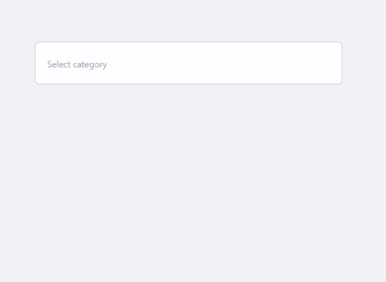

# MultiSelect Dropdown

## Description

This is a simple multi-select dropdown component that allows users to select multiple options from a dropdown list. It is built using JQuery and TailwindCss.

## Features

- Users can select multiple options from a dropdown list
- Users can search for options in the dropdown list
- Users can clear all selected options
- Users can clear individual selected options by either clicking on the 'x' button or by clicking on the selected option
- Users can clear the last selected option by pressing the backspace key
- Users can close the dropdown by clicking outside the dropdown

## Technologies

- HTML
- JQuery
- TailwindCss

## Demo

[Live Demo]()

